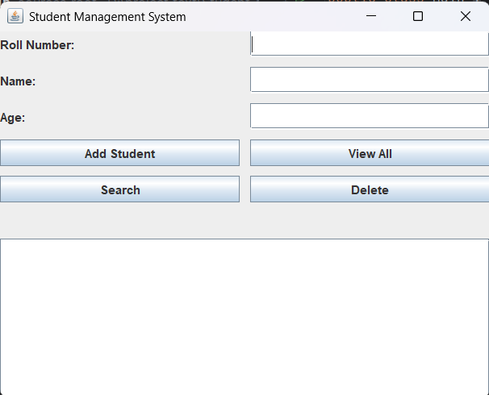
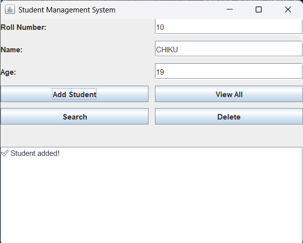
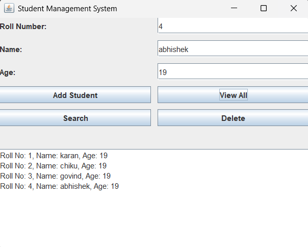

# 🎓 Student Management System - Java GUI

A complete *Student Management System* built with *Java Swing GUI*. This application allows administrators to manage student records efficiently, with full CRUD functionality and optional MySQL database integration.
(

---

## ✨ Features

- 🧑‍🎓 Add, edit, delete, and view student details
- 📚 Course and subject management
- 🔍 Search and filter students
- 📄 Report generation
- 🗃 MySQL database support (optional)
- 💡 Built using Java Swing (GUI-based)
- 🧱 MVC Architecture

---

## 📸 Screenshots

| Dashboard | Add Student | View Records |
|-----------|-------------|---------------|
|  |  |  |

---

## 🛠 Tech Stack

- *Language:* Java  
- *GUI:* Swing (Java Foundation Classes)  
- *Database:* MySQL (optional)  
- *Architecture:* MVC (Model-View-Controller)  
- *IDE:* IntelliJ IDEA / Eclipse  

---

## 🚀 Getting Started

### Prerequisites
- Java JDK 8 or higher
- MySQL Server (if using database)
- IDE (Eclipse, IntelliJ, or NetBeans)

### Installation

1. *Clone the repository*
   ```bash
   git clone https://github.com/yourusername/student-management-system.git
    cd student-management-system


---

### 👨‍💻 Contributors

- [**Deepanshu**](https://github.com/chikujaurasiya) – Project Author & Documentation Writer
- [**Karan**](https://github.com/Karankkg) – Game Logic Developer
- [**Govind**](https://github.com/Govind75418) – UI/UX Designer

***
